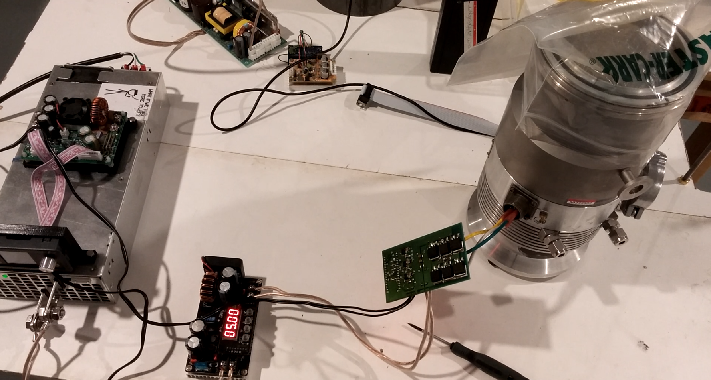

This is a small, simple half-bridge circuit that commutates 54 volts into 3-phase at 850 Hz, peak power of about 1 kw for a few minutes, for use with the Varian Turbo-V series of turbomolecular pumps. 

> WARNING: This board has only been tested for a few hours. The software does not provide any of the sensing or safety features present in the stock controller. It might blow up your pump, kill your cat, spin the earth around your impeller, etc.
>
> Not that I'm a paragon of best practice in any case, but this seriously isn't an acceptable level of quality. In particular, it was designed to be etched at home, as my normal board house was closed for the holidays.
> I've had one instance where shoot-through blew up one of the MOSFETs. I don't know what would happen if this occurs while the pump is at maximum speed. Adding fuses between the legs of the half-bridge would probably be a good idea to prevent catastrophic braking.

There are several other open-source turbomolecular pump controller projects online that are better developed and that might be preferable. In addition, the pumps use a kind of synchronous or induction motor, not a "brushless"-like, so no sensing is needed, only a constant 850 Hz, which is basically just a 3-phase VFD or motor controller. Unfortunately, I wasn't able to find any off-the-shelf system with the required parameters.

The circuit is simple enough to easily be built on perfboard. Schematic and bill of materials are [here](files/controller/assembly). The power MOSFETs are BUK9620, with MIC4604YM-TR half-bridge charge-pump drivers.

The input power was supplied by a MeanWell SE-1000-48 with the voltage trimpot adjusted to ~56V, through a DROK Model 200310 10-75V to 0-60V switching buck converter (Amazon), current limit set to about 8A. 

I highly recommend using such a constant-current regulator, because the power supply is extremely powerful - it's practically an arc flash hazard and will easily start a fire.

The MeanWell supply is probably overkill (very expensive), but a cheaper Amazon 48V supply exploded and I didn't want to tempt fate.

I don't know what terminations the turbopump connector uses; crimp butt connectors worked brilliantly.

## [Original Varian controller manual](references/Varian_V200_controller.pdf)

## [Pump manual](references/Varian_V200_turbo_pump.pdf)

### Things that should be added:

If the back-emf sensing is commutated improperly, -5v or so will be put into the sense ADC pins. The integral protection diodes might be okay with that, but probably not. This is disabled at the moment.

More filtering and decoupling should be added. This pump draws nearly 700 watts on startup - there are some massive transients on the power supply rail.

